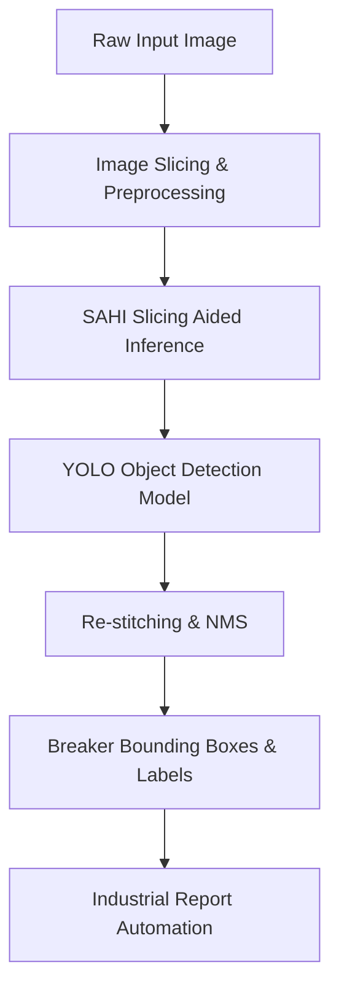

# Case Study: PanelSafe Breaker Detection

## 1. Executive Summary
PanelSafe is a computer vision-based SaaS module designed to automate industrial audits and documentation of electrical breaker panels. In standard operations, certified electricians spend significant manual effort documenting panel breaker states, leading to human errors, delays, and poor audit records. By training an object detection model to identify individual breakers, gauge their current state, and cross-reference them against schematics, PanelSafe automates this process entirely.

---

## 2. Technical System Architecture

### The YOLO & SAHI Pipeline
- **YOLO Architecture:** Used for localizing and classifying breakers. 
- **SAHI (Slicing Aided Hyper Inference):** Standard breaker boards feature a high concentration of small, repeating elements (breakers). Standard YOLO inference on large, high-resolution panel images often fails to detect these tiny objects. SAHI partitions the panel image into overlapping slices, runs inference on each slice, and merges the predictions via Non-Maximum Suppression (NMS), drastically increasing small object detection accuracy.

---

## 3. Data Engineering Defensibility

### Custom Primary Dataset
Because public data on industrial electrical panel boards is practically non-existent, we built a proprietary primary dataset of **80+** high-resolution parent images captured from active field installations under highly variable lighting conditions, angles, and distances.

### Synthetic Data Pipeline
To scale this dataset without manual annotation bottlenecks, we engineered a custom Python synthetic augmentation pipeline:
1. **Source Cropping:** Manually labeled and extracted individual breaker types from parent images (unboxed breakers, single/double pole switches).
2. **Background Masking:** Generated dynamic masks around breakers to remove original background noise.
3. **Automated Layout Pasting:** Wrote scripts using OpenCV and Pillow that dynamically select random breaker configurations and paste them onto various empty breaker box backgrounds, simulating diverse layouts.
4. **Scale:** This pipeline expanded our training dataset by **10x** while maintaining accurate, automated coordinate-level bounding labels.

---

## 4. Calibration & Real-World Domain Generalization

### Current Challenge (In Progress)
While our YOLO model achieved high validation metrics (**94.5%** mAP@50) on our synthetic-infused validation set, field testing revealed real-world domain drift. The model struggled to generalize to:
1. **Unboxed Breakers:** Panels lacking cover plates, exposing complex wire nests.
2. **Erratic Field Labels:** Non-standard markings, handwritten notes, and dust/dirt on switches.

### Active Iterations (Target: July 2026 Release)
- **Dataset Diversification:** Expanding background templates to include wire-heavy/uncovered panel boxes.
- **Color Jittering & Noise Augmentation:** Modifying the synthetic pipeline to inject random shadows, blurs, and dust-like artifacts to match real-world field conditions.
- **Model Tuning:** Adjusting IoU and confidence thresholds in the SAHI inference wrapper to calibrate precision-recall ratios.
